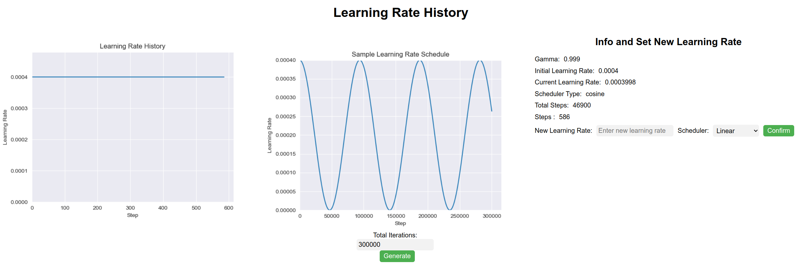

# WebLRScheduler

This repository provides an interactive Learning Rate Scheduler for PyTorch that allows users to visualize and adjust learning rate schedules during model training. The scheduler is implemented as a web server, enabling users to update the learning rate and scheduler type on-the-fly via a web interface. 

# Features
- Visualize learning rate history
- Update learning rate and scheduler type during training
- Supports Linear, Cosine, and Exponential learning rate schedules
- Automatically refreshes learning rate history every 2 seconds

# Getting Started


## Prerequisites

- Python 3.6 or higher
- Flask
- Matplotlib
- Torch (PyTorch)

## Installation

```
git clone https://github.com/wuchangsheng951/WebLRScheduler
cd WebLRScheduler
```

## Usage

1. Import the InteractiveLRScheduler (or the name you chose) class in your PyTorch training script.
```
from WebLRScheduler import WebLRScheduler
```
2. Replace your existing LR scheduler with an instance of the InteractiveLRScheduler class.
```
scheduler = WebLRScheduler(optimizer, lr_lambda, data_loader, total_iteration)
```
3. Run your training script as usual. The web interface will be accessible at http://127.0.0.1:5000.
